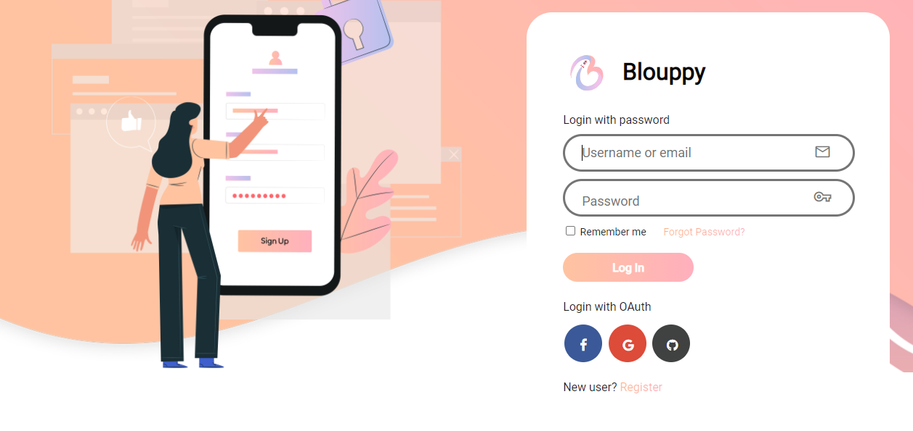
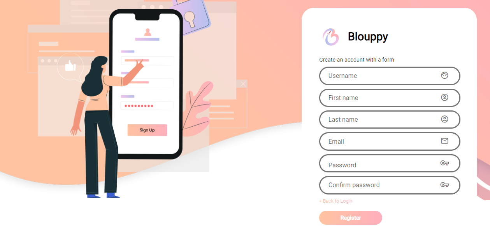
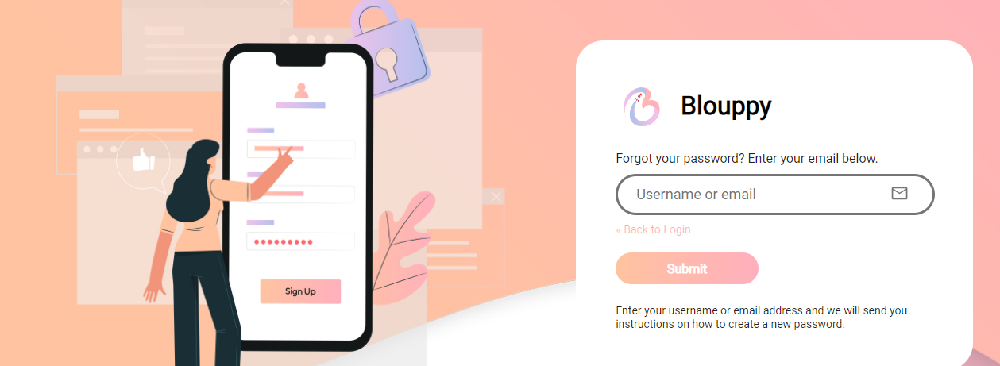

# Blouppy Keycloak Theme

A Keycloak theme for Blouppy App.

## Overview
This is an **incomplete** Keycloak login theme. Currently, this theme styles the "login", "register", and "forgot password" screens.  More layouts may be included in the future depending on demand.

## Installation

1. Download or clone this repository
2. Copy the `login` directory in this repository to `<your-keycloak-installation>/themes/blouppy-keycloak-theme`
3. Start or restart your Keycloak server.
4. Log into your Keycloak server's Administration Console.  Select the `blouppy` theme by navigating to Realm Settings → General → Themes → Login Theme.
